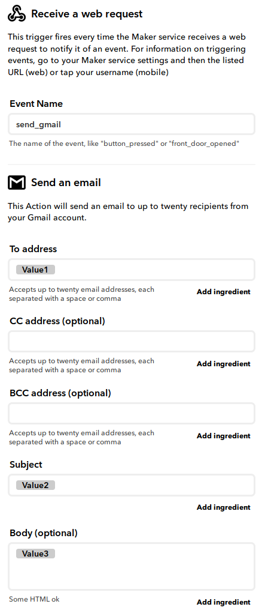
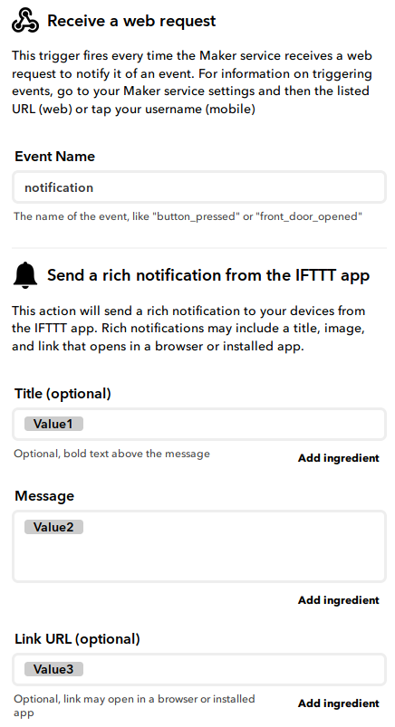

# IFTTT-Webhook
A Python module to trigger IFTTT events using webhooks.

## Installation

Installation can be made using pip:

```
pip install git+https://github.com/DrGFreeman/IFTTT-Webhook.git
```

Or from the source files:

```
python setup.py install
```

## Usage

```Python
from ifttt_webhook import IftttWebhook

# IFTTT Webhook key, available under "Documentation"
# at  https://ifttt.com/maker_webhooks/.
IFTTT_KEY = 'your_ifttt_webhook_key'

# Create an instance of the IftttWebhook class,
# passing the IFTTT Webhook key as parameter.
ifttt = IftttWebhook(IFTTT_KEY)

# Trigger the IFTTT event defined by event_name with the content
# defined by the value1, value2 and value3 parameters.
ifttt.trigger('envent_name', value1='value1', value2='value2', value3='value3')
```

Alternatively, the key can be stored in a text file (key alone on the first line) and the path to the file passed as parameter to the `IftttWebhook` class constructor as shown below:

```Python
# Key stored in the user's home directory in a file named key_file
ifttt = IftttWebhook('/home/user/key_file')
```

The `.trigger` method can be used in different ways as shown in the examples below:

```Python
# Ex. 1: Using keyword arguments allows skipping some parameters
ifttt.trigger('event_name', value2='value2')

# Ex. 2: 'value1', 'value2', 'value3' key: value pairs in a dictionary
# This method also allows skipping some parameters
event_values = {'value1': 'Value for value1',  'value3': 'Value for value3'}
# Unpack the dictionary in the method call
ifttt.trigger('event_name', **event_values)

# Ex. 3: 'value1', 'value2', 'value3' values in a tuple or list (in order)
event_values = ('value1', 'value2', 'value3')
# Unpack the tuple / list in the method call
ifttt.trigger('event_name', *event_values)
```

### Specific events methods

The `.trigger` method shown above allows to trigger any IFTTT Webhook. The module also contains convenience methods that trigger specific IFTTT events.


The specific methods currently implemented are:
1. [`.gmail`](https://github.com/DrGFreeman/IFTTT-Webhook#send_gmail)
1. [`.notification`](https://github.com/DrGFreeman/IFTTT-Webhook#send_notification)

#### Send Gmail

The `.gmail` method sends an email using the users' Gmail account.

```Python
ifttt.gmail(to='someone@example.com', subject='This is the subject',
            body='This is the email body.')
```

This method triggers an event named 'send_gmail' where the 'value1', value2' and 'value3' "ingredients" of the webhook are mapped to the 'To address', 'Subject' and 'Body' fields of the action respsectively (see below). This event must first be created in the user's IFTTT account in order to work.



#### Send Notification

The `.notification` method sends a notification the user's mobile device via the IFTTT mobile application.

```Python
ifttt.notification(title='IFTTT notification',
                   message='Checkout this project on GitHub!',
                   url='https://github.com/DrGFreeman/IFTTT-Webhook')
```

This method triggers an event named 'notification' where the 'value1', value2' and 'value3' "ingredients" of the webhook are mapped to the 'Title', 'Message' and 'Link URL' fields of the action respsectively (see below). This event must first be created in the user's IFTTT account in order to work.


